# miomnibqaws 🔎😶‍🌫️🪣
miomnibqaws : Google Cloud &amp; AWS Integration # BigQuery Omni # S3 # External Table

## Objective
 - Create connection between Google Cloud & AWS
 - Authorize BigQuery Omni to read data in an AWS S3 bucket
 - Create BigQuery external table that references the raw data in AWS S3 bucket (Green Taxi Trip data)
 - Run queries on AWS S3 data
 - Export query results to AWS S3 bucket

# miomnibqawss

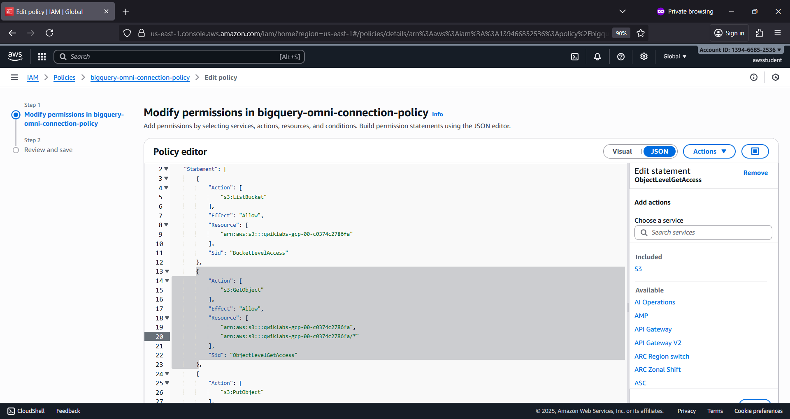

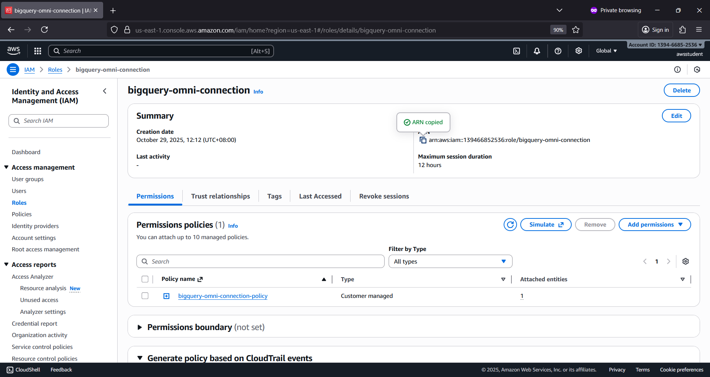

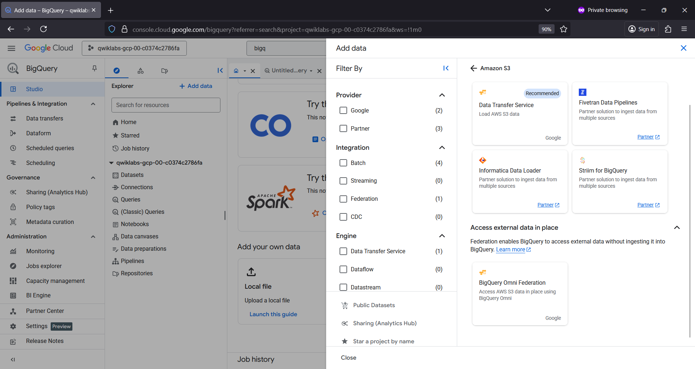

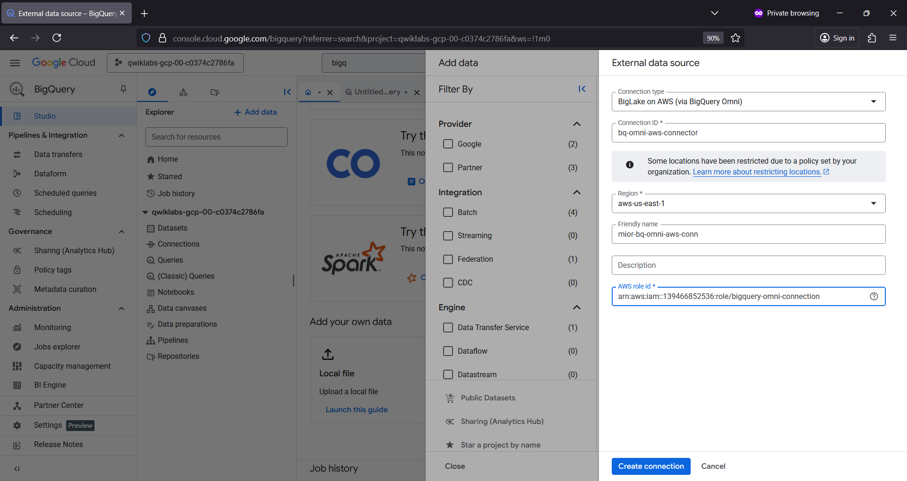

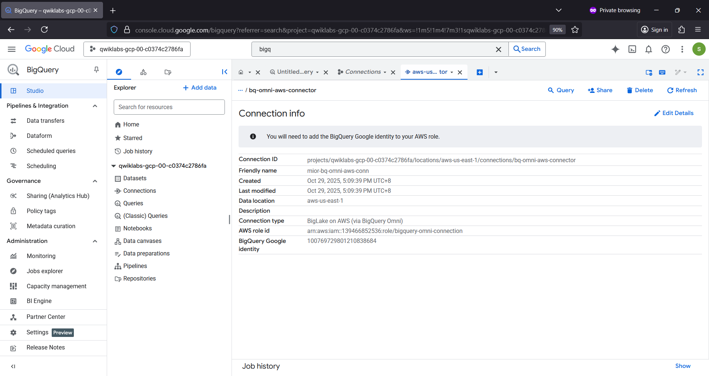

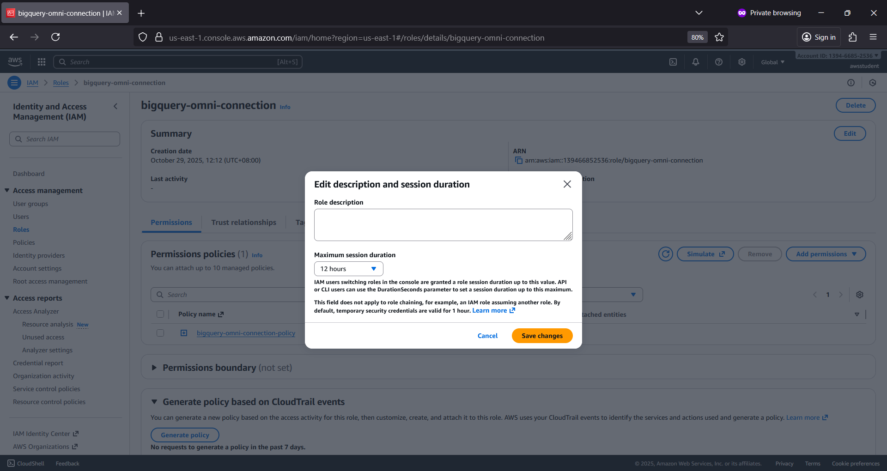

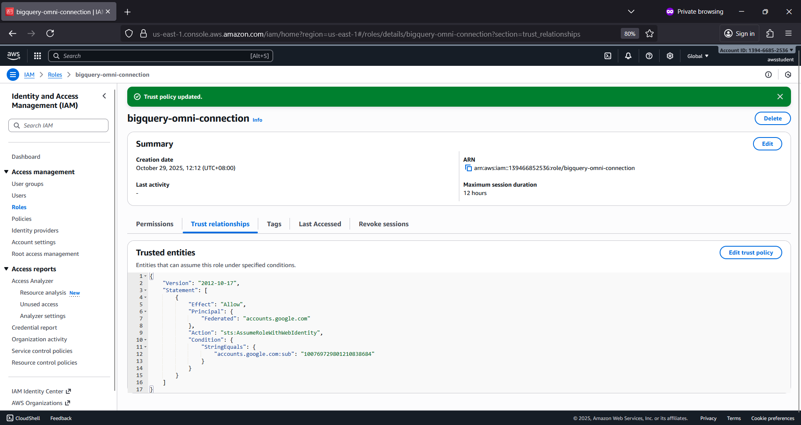

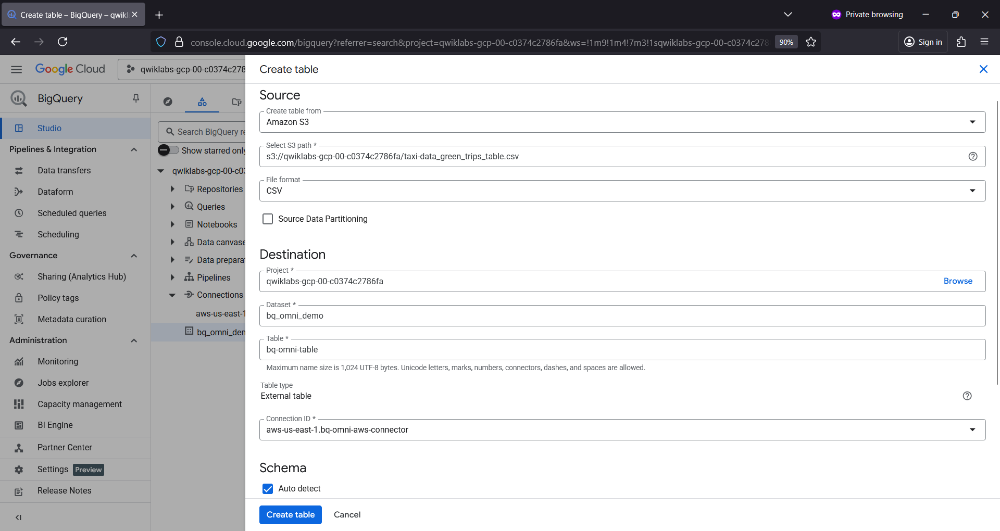

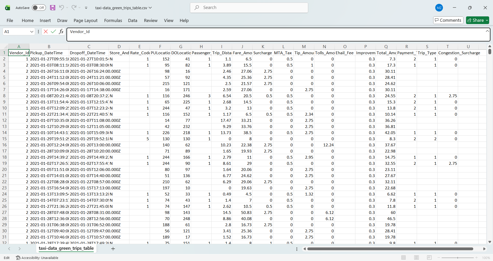

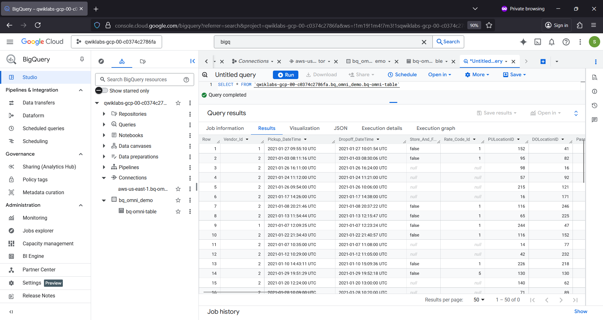

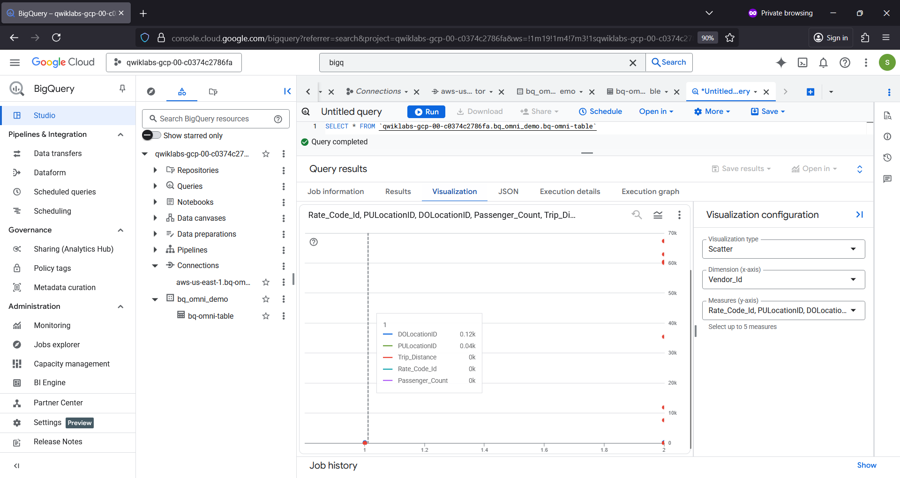

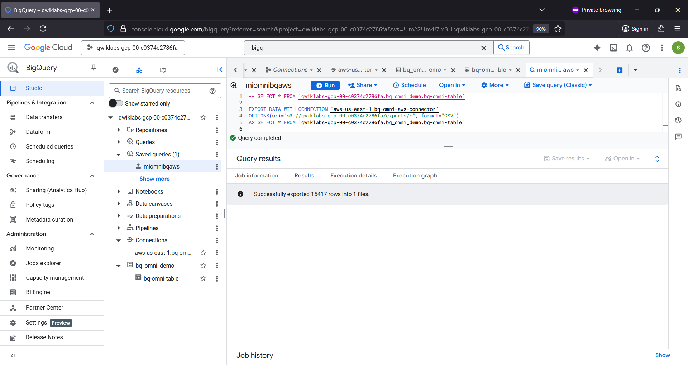

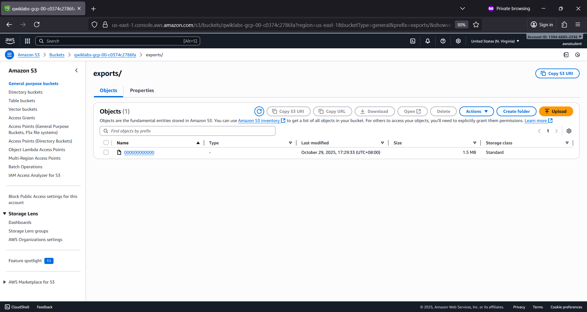

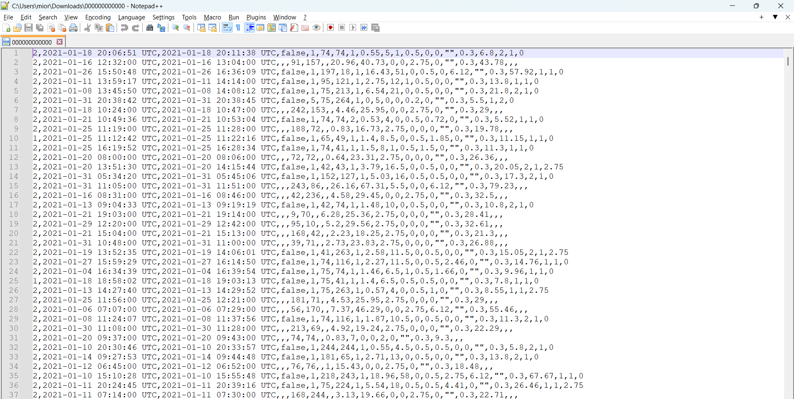

